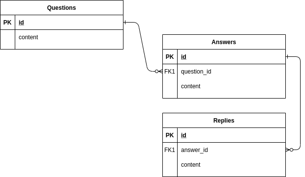
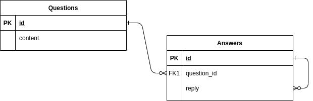
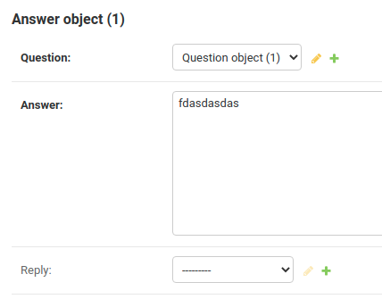
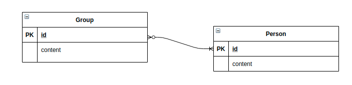
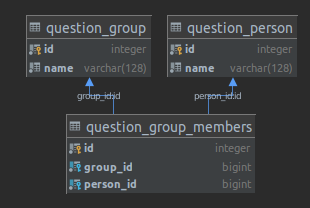
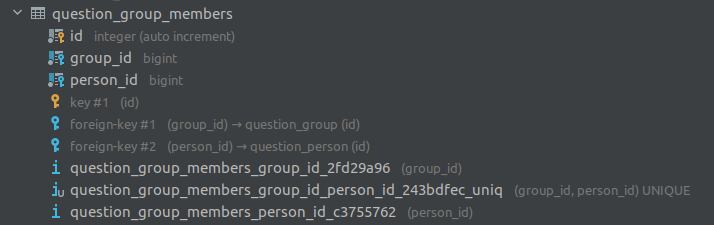
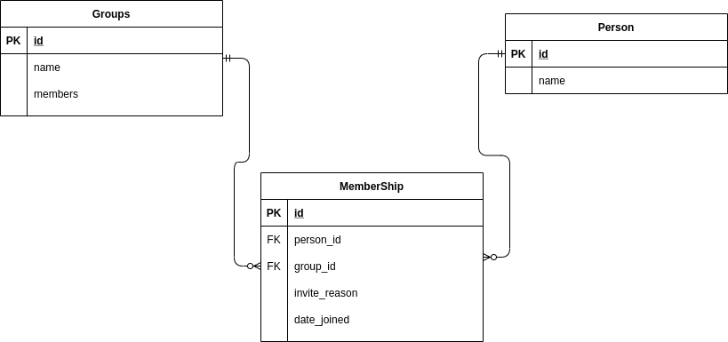
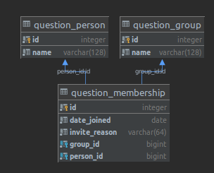

# Section 4: Building Models with ORM Django
## Lesson overview
- Learn overview and how to using Models in DJango

## Overview and how to using Models in DJango
### Overview
- Models is similar to table in Database.
- The attributes and data types used by the Model are the fields in the table that are mapped by the ORM, we will see this in more detail in this section.
- Example:
  - Create table Person with Models


    ```
    from django.db import models

    class Person(models.Model):
        first_name = models.CharField(max_length=30)
        last_name = models.CharField(max_length=30)
    ```
    - Create table Person with SQL
    ```
    CREATE TABLE myapp_person (
        "id" serial NOT NULL PRIMARY KEY,
        "first_name" varchar(30) NOT NULL,
        "last_name" varchar(30) NOT NULL
    );
    ```
- Notes:
  - An `id` field is added automatically, but this behavior can be overridden
### Using Models
- You need register the model with app in `settings.py`

```
INSTALLED_APPS = [
    #...
    'myapp',
    #...
]
```
- When you add new apps to INSTALLED_APPS, be sure to run `manage.py migrate`, optionally making migrations for them first with `manage.py makemigrations`.

## Fields
### Overview
- Fields are properties of the class that inherits models.Model. They help define the data type for storage in the DB. These subscriptions will be mapped to the colum in the Table.
- Example:
```
from django.db import models

class Musician(models.Model):
    first_name = models.CharField(max_length=50)
    last_name = models.CharField(max_length=50)
    instrument = models.CharField(max_length=100)

class Album(models.Model):
    artist = models.ForeignKey(Musician, on_delete=models.CASCADE)
    name = models.CharField(max_length=100)
    release_date = models.DateField()
    num_stars = models.IntegerField()
```
### Field types
- These field types are instances that inherit from the Field class created by Django which helps us define the data type under the DB, and the processing before sending to the DB, ex: validation, check...
- Example:
  - CharField: A string field, for small- to large-sized strings.
  - BooleanField: A true/false field.
  - EmailField: A CharField that checks that the value is a valid email address using EmailValidator.
  - ImageField: Inherits all attributes and methods from FileField, but also validates that the uploaded object is a valid image.
  - TextField: A large text field. The default form widget for this field is a Textarea.
### Field options
- With that said, field types contain certain conditions for data processing before they are put into the DB. So there will always be separate arguments for each data type to satisfy certain use-cases. See more [here](https://docs.djangoproject.com/en/3.2/ref/models/fields/#common-model-field-options)
- Example:
  - `nulll`: If True, Django will store empty values as NULL in the database. Default is False.
  - `blank`: If True, the field is allowed to be blank. Default is False.(Using in Form)
  - `default`: The default value for the field. This can be a value or a callable object. If callable it will be called every time a new object is created
  - `unique`: If True, this field must be unique throughout the table.

## Relationships
- Clearly, the power of relational databases lies in relating tables to each other. Django offers ways to define the three most common types of database relationships: many-to-one, many-to-many and one-to-one.
- Example: I will bring you an example of a StackOver Flow System consisting of Question, Answer, Reply. Based on this case I will analyze the relations that will exist in Django and special cases appear like Recursive Relationship, Reverse Relationship

  
### Many-to-one relationships
- First, This is the basic relationship in SQL, it shows the relational properties between 2 tables. But the point to note when creating Many-to-One is to clearly define which is Many and which is One.
- In this example, I determined that a question will always have many different answers, so it follows that: Question is One, Answer is Many.

```
class Question(models.Model):
    title = models.CharField(max_length=10)

class Answer(models.Model):
    question = models.ForeignKey(Question, on_delete=models.CASCADE)
```
- ForeignKey accepts other arguments that define the details of how the relation works.
- I will introduce to you two commonly used parameters in a Many-to-One relationship: `on_delete`, `related_name`
  - `on_delete`: When an object referenced by a ForeignKey is deleted, Django will emulate the behavior of the SQL constraint specified by the `on_delete` argument
    - Delete object when the referenced object is deleted
      ```
      class Answer(models.Model):
        question = models.ForeignKey(Question, on_delete=models.CASCADE)
      ```
    - Set object is null when the referenced object is deleted
      ```
      class Answer(models.Model):
        question = models.ForeignKey(
          Question, models.SET_NULL,
          blank=True,
          null=True, 
        )
      ```
  - `related_name`: This parameter also indicates a new relationship called Reverse Relationship, Reverse relationship is basically a concept to access objects in the reverse direction of the relation defined
    ```
    question = Question.objects.all()
    answer = question.answer.all()
    ```
    - Reverse query really has many benefits, but in some cases it will affect Security. Let's avoid reverse query using put '+'
    ```
    class Answer(models.Model):
      question = models.ForeignKey(
          Question,
          on_delete=models.CASCADE,
          related_name='+',
      )
    ```
#### Recursive Relationship
- This is a special case in this case, as mentioned in ERD we will see 3 tables Question, Answer, Reply. The relations indicate that Answer has a Many-to-one relationship with Reply. Maybe FK to set, the important thing is if Answer and Reply have the same property, they can still merge Table, So the relationship will turn into the following:


  
- Code:

  ```
  class Answer(models.Model):
      question = models.ForeignKey(Question, on_delete=models.CASCADE, related_name='question')
      answer = models.TextField()
      reply = models.ForeignKey(
          'self', on_delete=models.CASCADE,
          blank=True,
          null=True, related_name='replies'
      )
  ```
- Result:


### Many-to-many relationships
- Use ManyToManyField to define many to many relations between two models. Any of the two models can have the ManyToManyField defined but generally you should have it in the object that you’re creating/editing
- For example, if a Group has multiple Members objects – that is, a Topping can be on multiple pizzas and each Pizza has multiple toppings – here’s how you’d represent that:


  


  ```
  class Person(models.Model):
      name = models.CharField(max_length=128)

      def __str__(self):
          return self.name

  class Group(models.Model):
      name = models.CharField(max_length=128)
      members = models.ManyToManyField(Person)

      def __str__(self):
          return self.name
  ```
  - Result:


  
- Notes: In SQL, there is only the use of FK to build relationships, so Many-to-many is essentially using an intermediate table with 2 foreign keys to 2 primary tables.
#### Extra fields on many-to-many relationships
- Let's take a look at the intermediate table after configuring Models as above.


  


- Django builds the default intermediate table as above, this in some cases will not be possible to query some of the data needed in both tables but use the intermediate table, so the default table will not be correct for all case. Here I will add to the intermediate table 2 fields `invite_reason`, `date_joined`


  
- Code:

  ```
  class Person(models.Model):
    name = models.CharField(max_length=128)

    def __str__(self):
        return self.name


  class Group(models.Model):
      name = models.CharField(max_length=128)
      members = models.ManyToManyField(Person, through='Membership')

      def __str__(self):
          return self.name


  class Membership(models.Model):
      person = models.ForeignKey(Person, on_delete=models.CASCADE)
      group = models.ForeignKey(Group, on_delete=models.CASCADE)
      date_joined = models.DateField()
      invite_reason = models.CharField(max_length=64)
  ```
- Result:


  
### One-to-one relationships
- One-to-One is a relationship that builds to extend from the main object, which helps the system to offload a lot of storage for objects with lots of private information.
- For example, if you were building a database of “places”, you would build pretty standard stuff such as address, phone number, etc. in the database. Then, if you wanted to build a database of restaurants on top of the places, instead of repeating yourself and replicating those fields in the Restaurant model, you could make Restaurant have a OneToOneField to Place (because a restaurant “is a” place; in fact, to handle this you'd typically use inheritance, which involves an implicit one-to-one relation).


  
```
from django.db import models

class Place(models.Model):
    name = models.CharField(max_length=50)
    address = models.CharField(max_length=80)

    def __str__(self):
        return "%s the place" % self.name

class Restaurant(models.Model):
    place = models.OneToOneField(
        Place,
        on_delete=models.CASCADE,
        primary_key=True,
    )
    serves_hot_dogs = models.BooleanField(default=False)
    serves_pizza = models.BooleanField(default=False)

    def __str__(self):
        return "%s the restaurant" % self.place.name

class Waiter(models.Model):
    restaurant = models.ForeignKey(Restaurant, on_delete=models.CASCADE)
    name = models.CharField(max_length=50)

    def __str__(self):
        return "%s the waiter at %s" % (self.name, self.restaurant)
```