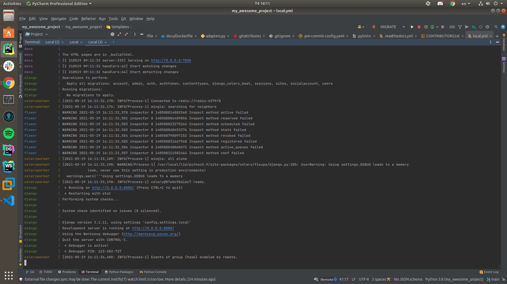
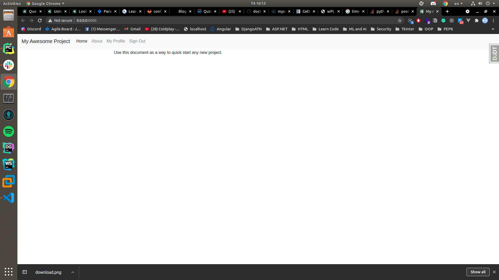
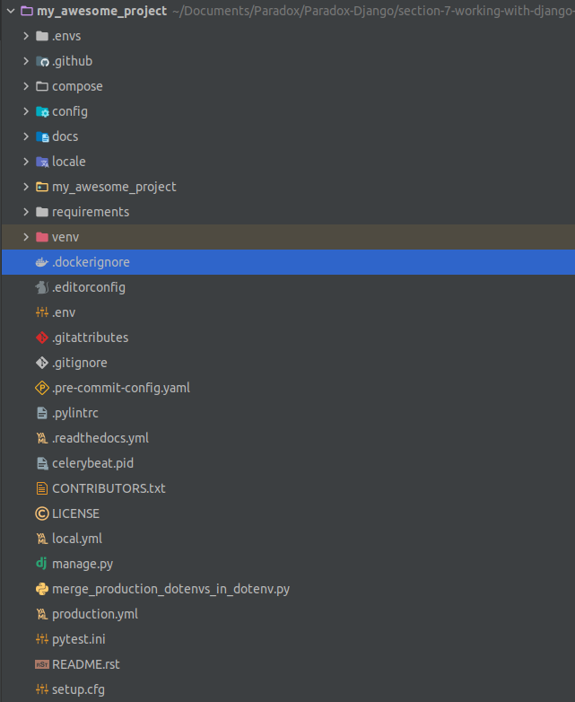

# Section 8: Working with Django Cookie Cutter and Docker
## Django Cookie Cutter
- Powered by Cookiecutter, Cookiecutter Django is a framework for jumpstarting production-ready Django projects quickly.
### Features:
- For Django 3.1
- Works with Python 3.9
- Renders Django projects with 100% starting test coverage
- Twitter Bootstrap v4 (maintained Foundation fork also available)
- 12-Factor based settings via django-environ
- Secure by default. We believe in SSL.
- Optimized development and production settings
- Registration via django-allauth
- Comes with custom user model ready to go
- Optional basic ASGI setup for Websockets
- Optional custom static build using Gulp and livereload
- Send emails via Anymail (using Mailgun by default or Amazon SES if AWS is selected cloud provider, but switchable)
- Media storage using Amazon S3 or Google Cloud Storage
- Docker support using docker-compose for development and production (using Traefik with LetsEncrypt support)
- Procfile for deploying to Heroku
- Instructions for deploying to PythonAnywhere
- Run tests with unittest or pytest
- Customizable PostgreSQL version
- Default integration with pre-commit for identifying simple issues before submission to code review

### Install and Setup
- Step 1: Setting virtual enviroment
    ```
    python3.8 -m venv venv
    ```
    - Notes: Use your python version. mine is python 3.8.10

- Step 2: Activate the virtualenv you have just created:

    ```
    source <virtual env path>/bin/activate
    ```
- Step 3: Using Pip install cookiecutter

    ```
    pip3.8 install "cookiecutter>=1.7.0"
    ```
- Step 4: Install cookiecutter-django:

    ```
    cookiecutter gh:pydanny/cookiecutter-django
    ```
    - Choose option for the create project, please read the docs [here](https://cookiecutter-django.readthedocs.io/en/latest/project-generation-options.html)
- Step 5: Install development requirements:

    ```
    $ pip3.8 install -r requirements/local.txt
    $ git init # A git repo is required for pre-commit to install
    $ pre-commit install
    ```
- Step 6: Create DB

    ```
    createdb <what you have entered as the project_slug at setup stage> -U postgres --password <password>
    ```
- Step 7: Set the environment variables for your database(s):
    ```
    $ export DATABASE_URL=postgres://postgres:<password>@127.0.0.1:5432/<DB name given to createdb>
    # Optional: set broker URL if using Celery
    $ export CELERY_BROKER_URL=redis://localhost:6379/0
    ```
- Step 8: Build the Stack

    ```
    docker-compose -f local.yml build
    ```
- Step 9: Run the Stack

    ```
    docker-compose -f local.yml up
    ```
## Result:
- Run docker-compose

- Web view

- App overvew

